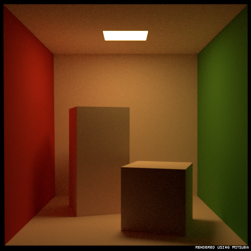
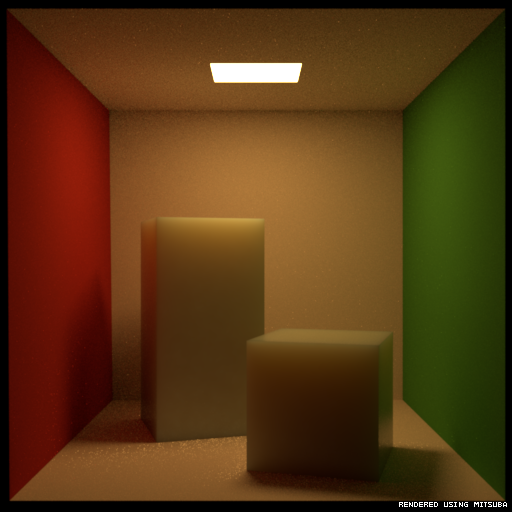
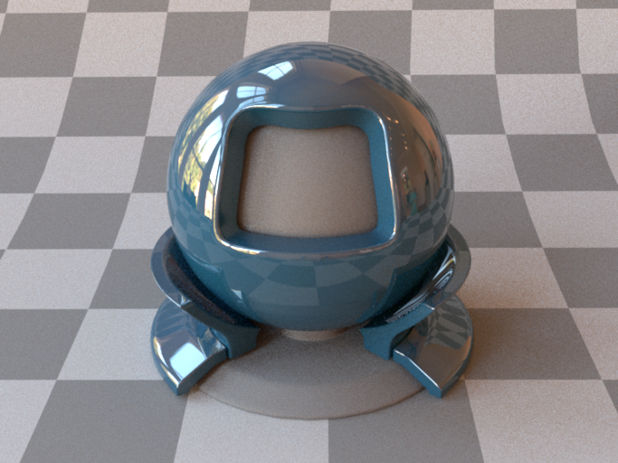
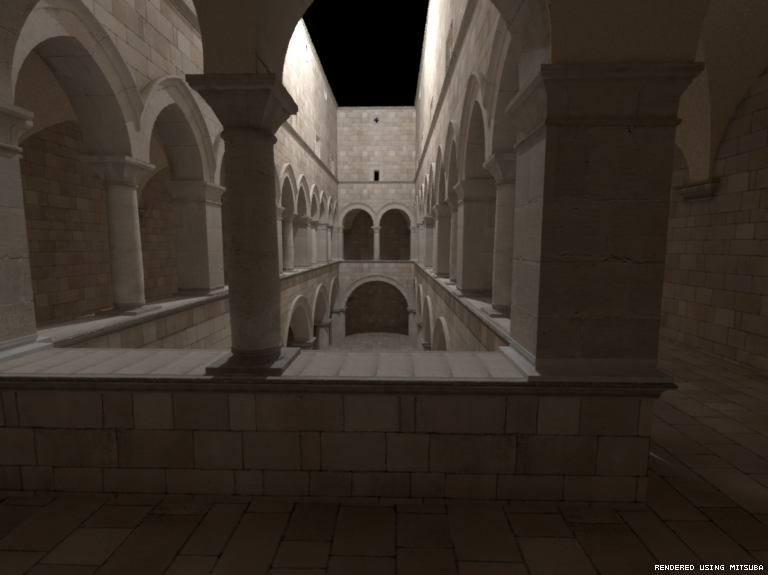
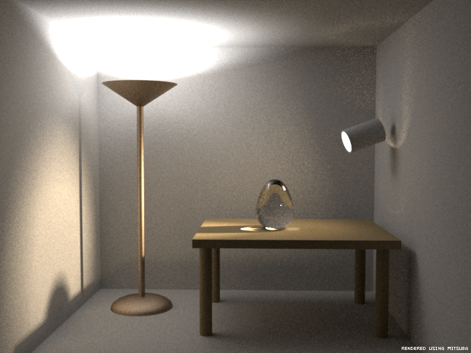
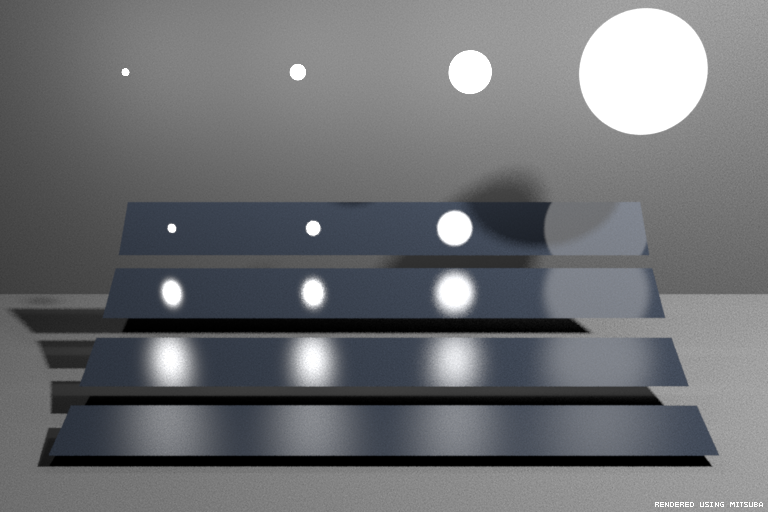

# Example Scenes

Six reference scenes originally bundled with Mitsuba 0.4.0, upgraded to
the 0.6.0 scene file format. All of them render correctly with the
CMake-built `mitsuba` binary.

## Scenes

| Directory        | Description                                               |
|------------------|-----------------------------------------------------------|
| `cbox/`          | Cornell Box – classic path-tracer smoke test              |
| `cbox_sss/`      | Cornell Box variant using subsurface scattering            |
| `matpreview/`    | Material previewer with HDR environment map               |
| `sponza/`        | Sponza atrium – heavy geometry + textured materials       |
| `veach_bidir/`   | Veach MIS / bidirectional test                            |
| `veach_mi/`      | Veach manifold-integrator test                            |

## Version bump

Each scene originally declared `<scene version="0.4.0">`. Mitsuba 0.6.0
refuses to load scenes whose major.minor version does not match the
runtime (`isCompatible` requires `major == major && minor == minor`),
and `0.4.0 < 0.6.0` triggered the "older version" error. The string was
bumped to `0.6.0` in every `*.xml`; the rest of the file format is
backward-compatible so no other changes were needed.

If you re-extract a fresh copy of any of these scenes, remember to
patch the version line before rendering with this build.

## Rendering

A Release build lives in `build/cmake_release/bin/mitsuba`. The build
directory holds the matching `plugins/` and the libraries on the
loader path. The simplest way to launch it is:

```sh
export LD_LIBRARY_PATH="$PWD/build/cmake_release/bin:$LD_LIBRARY_PATH"
cd scenes/<scene>
../../build/cmake_release/bin/mitsuba -o out.exr <scene>.xml
```

(An older unoptimised build is also still around in
`build/cmake_build/`, kept only for comparison; use the release one.)

## Reference renders

For each scene, a converged reference render is checked in alongside
the source as `<scene>_<width>_<height>_<integrator>_<spp>.png`
(tonemapped from the matching `.exr` with `mtsutil tonemap`, sRGB
gamma, no further tweaking). The images are not the goal of the
project – they're a sanity check that the bundled scene still renders
on this build.

Times are wall-clock on this machine (Release build, 16 cores, single
machine, no network rendering):

| File                                                | Resolution    | Integrator    | SPP | Render time |
|-----------------------------------------------------|---------------|---------------|-----|-------------|
| `cbox/cbox_512_512_path_64.png`                     | 512 × 512     | path          | 64  | 3.3 s       |
| `cbox_sss/cbox_512_512_path_64.png`                 | 512 × 512     | path          | 64  | 51.3 s      |
| `matpreview/matpreview_683_512_path_64.png`         | 683 × 512     | path          | 64  | 8.1 s       |
| `sponza/sponza_768_575_photonmapper_4.png`          | 768 × 575     | photonmapper  | 4   | 11.8 s      |
| `veach_bidir/bidir_768_576_bdpt_64.png`             | 768 × 576     | bdpt          | 64  | 44.5 s      |
| `veach_mi/mi_768_512_direct_16.png`                 | 768 × 512     | direct        | 16  | 2.3 s       |

Note: sponza's scene XML wraps the photon mapper in an `irrcache`
integrator; the filename uses the inner one (`photonmapper`) since
that's what actually traces rays.

### Previews

#### cbox — 512×512, path, 64 spp, 3.3 s


#### cbox_sss — 512×512, path, 64 spp, 51.3 s


#### matpreview — 683×512, path, 64 spp, 8.1 s


#### sponza — 768×575, photonmapper, 4 spp, 11.8 s


#### veach_bidir — 768×576, bdpt, 64 spp, 44.5 s


#### veach_mi — 768×512, direct, 16 spp, 2.3 s

